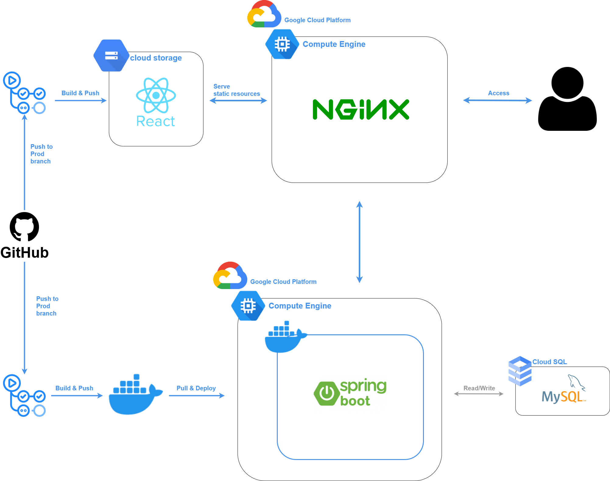
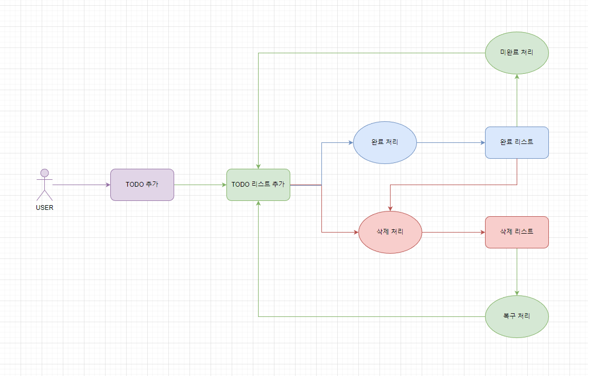
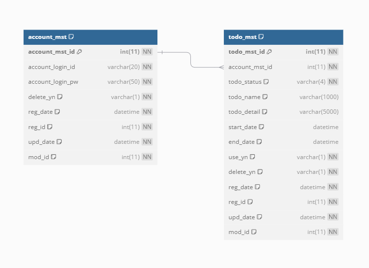
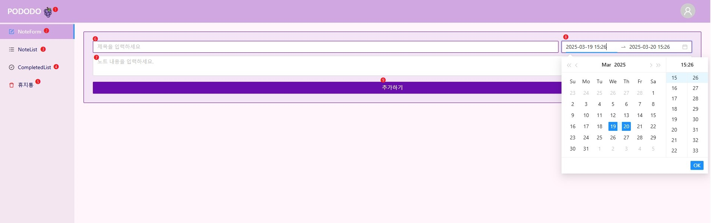
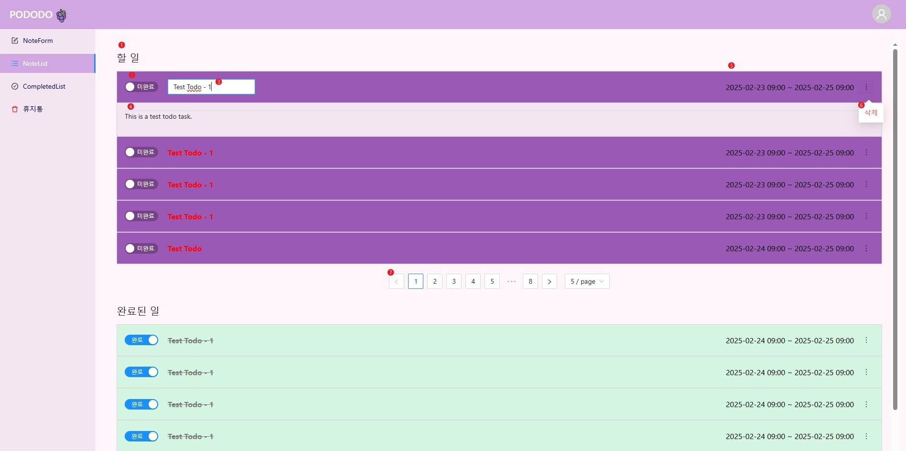
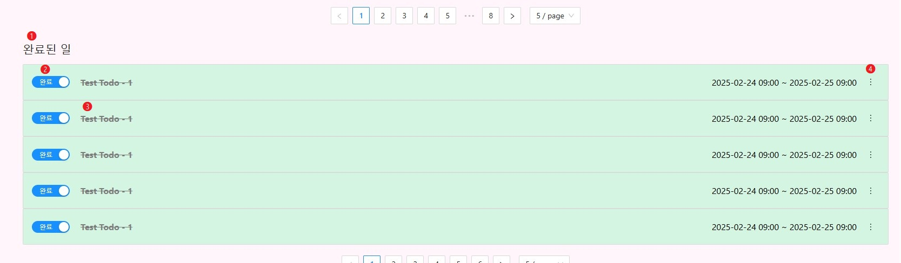
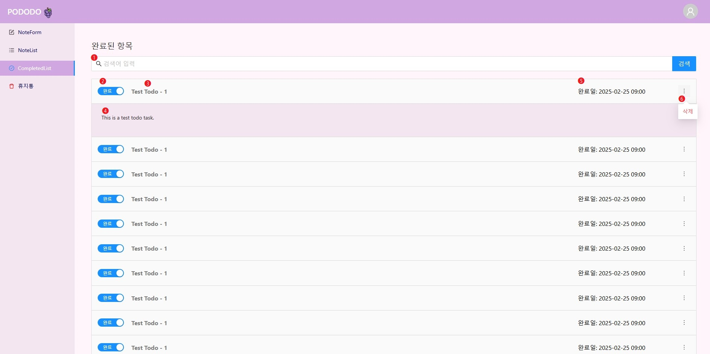
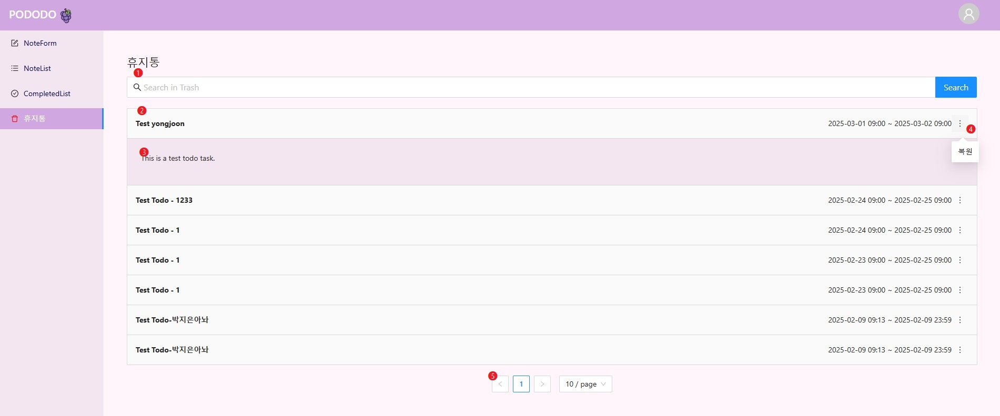

# 🍇pododo

👥 Front-End 1, Back-end 2  
📆 2025-03-27 

---
## Service Architecture Flow

---
## Usecase

---
## Database ERD

---
## Service Guide
### 📝NoteForm

1. PODODO 로고 클릭 시 Note Form 화면으로 이동합니다.
2. Note Form 화면으로 이동합니다.
3. Note List 화면으로 이동합니다.
4. Completed List 화면으로 이동합니다.
5. 휴지통 화면으로 이동합니다.
6. Todo의 타이틀을 입력하는 Form 입니다.
7. Todo의 내용을 입력하는 Form 입니다.
8. Todo의 시작, 완료 기간을 설정합니다.
9. 입력한 Form 내용을 저장하는 버튼입니다.

### 📒 NoteList
**할 일**

1. 등록 된 할 일 리스트를 출력합니다.
2. 완료 처리를 위한 토글 처리 버튼입니다.
3. Todo 타이틀을 출력 및 클릭으로 수정합니다.
4. Todo 내용을 출력 및 클릭으로 수정합니다.
5. Todo 일정을 표시합니다.
6. 등록 된 Todo를 삭제합니다.
7. 리스트의 페이지를 표시합니다.

**완료된 일**

1. 당일 완료된 일 리스트를 출력합니다.
2. 완료 된 리스트를 미완료 변경 가능하게 토글 처리 버튼입니다.
3. 완료 된 리스트는 가로선으로 표시됩니다.
4. 삭제버튼 입니다.

### ✅ CompletedList

1. 완료 된 리스트를 검색합니다.
2. 완료 된 리스트를 미완료 변경 가능하게 토글 처리 버튼입니다.
3. Todo 타이틀을 출력합니다.
4. Todo 내용을 출력합니다.
5. 완료 된 일정을 표시합니다.
6. 삭제버튼 입니다.

### 🚮 휴지통

1. 삭제 된 리스트를 검색합니다.
2. 삭제 된 Todo 타이틀을 출력합니다.
3. 삭제 된 Todo 내용을 출력합니다.
4. 삭제 된 Todo를 복원하는 버튼입니다.
5. 리스트의 페이지를 표시합니다.

---
## API
**Postman**  
https://documenter.getpostman.com/view/42559961/2sAYdfrBJh

**Swagger**  
https://pododo.xyz/swagger-ui/index.html

---
## Convention
**Git**  
https://evening-way-00b.notion.site/Git-Flow-197544158f8980f9ade1df996c9517b8

